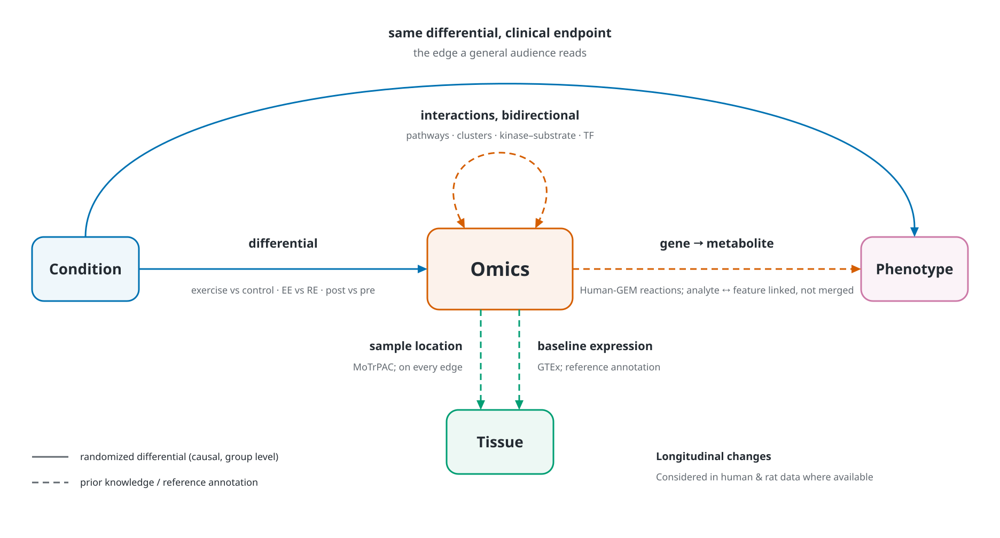

# Exercise multi-omics knowledge graph: overview

A knowledge graph that links exercise, tissues, omics and phenotypes.
The primary data are the MoTrPAC human and rat releases; GTEx and Human-GEM add tissue and metabolic context. This document explains the structure of the graph and the datasets behind it. 

---

## 1. Structure of the graph

*The four entity classes and the five edge types. Solid arrows are randomized differentials from the
MoTrPAC design; dashed arrows are prior knowledge or reference annotation; the double-headed arrow is
bidirectional. The two Omics to Tissue arrows are the two kinds of tissue edge. What each class contains
is listed below.*

### The 4 entity classes

1. **Condition.** Who was perturbed and how. Exercise type (endurance, resistance, control) is the main
   intervention. Sex and age group are demographics.
2. **Tissue.** Where the measurement was taken: skeletal muscle, adipose, and the blood fractions. The blood fractions are siblings under one parent rather
   than independent tissues.
3. **Omics.** What was measured: chromatin state, transcript, protein, phosphosite, metabolite. Gene is
   the anchor that ties them together: a transcript, a protein and a phosphosite can all map to the same
   gene, and a metabolite maps to the genes whose enzymes act on it.
4. **Phenotype.** What it means for health: measured clinical readouts (blood glucose, lactate, insulin,
   muscle-damage markers) and, one step further out, disease traits that outside evidence links to the
   same genes.

### How the classes connect

- **Condition -> Omics.** The differential between condition groups on each omics feature: exercise
  versus control, endurance versus resistance, post versus pre. Directed, because the groups were
  randomized. Every edge carries the tissue and timepoint it was measured in, the effect size and FDR.
- **Condition -> Phenotype.** The same differential landing on a clinical readout (glucose, lactate,
  insulin, creatine kinase) instead of an omics feature. Same evidence, different endpoint: this is the
  edge a general audience reads.
- **Omics <-> Omics.** Bidirectional interactions within and between omics layers: gene to gene through
  shared pathways and co-expression clusters, protein to protein through kinase-substrate and
  transcription-factor relations, gene to protein and phosphosite through the feature-to-gene map. These
  edges are undirected by default; a direction is attached only where prior knowledge supplies one, such
  as kinase to substrate, never from the intervention alone.
- **Omics -> Phenotype.** Primarily gene to metabolite: an enzyme or transporter gene is linked to the
  metabolites its product acts on through Human-GEM reactions. Blood metabolites are the omics layer
  closest to physiology, so this edge is the bridge from mechanism to readout. Where a clinical analyte
  and an omics feature measure the same thing (lactate, insulin), the two are linked, not merged.
- **Omics -> Tissue.** Two kinds of tissue edge, kept apart. (1) Acquired sample location: the tissue an
  omics feature was measured in, an attribute of every MoTrPAC edge. (2) GTEx localization: the tissues
  a gene is normally expressed in at baseline, a reference annotation that says nothing about the
  exercise response.

---

## 2. Datasets

| Source | What it is | Where it lives |
|---|---|---|
| MoTrPAC human acute-exercise release (2026) | multi-omic response of 175 adults to one bout of endurance or resistance exercise, three tissues, hours scale | CFDE (MoTrPAC data coordinating center) |
| MoTrPAC rat endurance-training release (2024) | multi-omic response of 147 rats to 1 to 8 weeks of treadmill training, 19 tissues, both sexes | CFDE (MoTrPAC data coordinating center) |
| GTEx v8 | baseline gene expression and cis-eQTLs across about 50 human tissues | CFDE (GTEx data coordinating center) |
| Human-GEM | curated genome-scale model of human metabolism: reactions, metabolites and their genes | external public (SysBioChalmers, GitHub) |

### 2.1 MoTrPAC human acute-exercise release (primary)

The Molecular Transducers of Physical Activity Consortium randomized 175 sedentary adults to a single
bout of endurance exercise, resistance exercise, or seated rest, and sampled blood, skeletal muscle and
subcutaneous adipose before, during and up to 24 hours after. Blood was profiled for transcripts,
targeted proteins, metabolites, clinical chemistry and DNA methylation; muscle and adipose for
transcripts, proteins, phosphosites, metabolites and DNA methylation, with chromatin accessibility in
muscle and PBMC.

What the public release contains: the consortium's differential-analysis results for every tissue, assay,
contrast and timepoint (models adjusted for sex, age, BMI and site, with a per-person random effect),
group-level summary statistics, pathway and kinase enrichment, temporal co-expression clusters, a
feature-to-gene map, and nine clinical blood analytes. Subject-level measurements, detailed phenotypes and
genotypes are access-controlled and are not used.

What it gives the graph: every human causal edge. Exercise to omics, exercise to clinical phenotype,
and the derived layers (pathway enrichment, kinase activity, temporal clusters) that inherit their
direction from those contrasts. Each edge carries tissue, timepoint, effect size and FDR.

Limits: hours, not weeks; three tissues; group-level effects only; sex and age adjusted for but not
stratified; no genetics.

### 2.2 MoTrPAC rat endurance-training release (second cohort)

MoTrPAC's animal study uses rats, not mice. 147 six-month-old Fischer 344 rats of both sexes ran on a
treadmill for 1, 2, 4 or 8 weeks against sex-matched sedentary controls. 19 tissues were profiled,
including skeletal muscle, heart, liver, kidney, lung, white and brown adipose, blood and several brain
regions, across nine omes: transcripts, proteins, phosphorylation, acetylation, ubiquitination,
metabolites, immunoassays, chromatin accessibility and DNA methylation. Every contrast is fit per sex.
The package is fully public, including sample-level matrices and animal phenotypes.

What it gives the graph:

- **Training scale.** Weeks of adaptation rather than hours of acute response, a second time axis.
- **Sex-stratified edges.** Every rat effect is reported for males and females separately.
- **Tissue breadth.** Organs the human study did not sample, with the same molecular readouts.
- **Sample-level data.** Omics-to-phenotype correlations that are impossible in the human release.

How it joins: rat genes map to human genes through one-to-one orthology (about 21,000 pairs), and
metabolites join through shared RefMet names. Rat edges carry species, sex and week and are kept as their
own evidence type. A human acute edge and a rat training edge on the same gene are never merged into one
claim, but they can be traversed together and pooled with a species moderator where the design allows.

Limits: different species and intervention type; endurance only; one strain and one age; no genetic
variation (inbred); no clinical phenotype edges of the human kind.

### 2.3 GTEx v8 (tissue localization and genetic prior)

The Genotype-Tissue Expression project profiled bulk gene expression and whole-genome genotypes across
about 50 tissues from roughly 950 post-mortem donors. Two products are used:

- **Median expression per tissue**, to say where a gene is normally expressed. A gene perturbed by
  exercise in muscle is annotated with its baseline expression in blood, muscle, adipose, liver, kidney
  and heart, its dominant tissue and a tissue-specificity score. This is how "tissue localization" enters
  the graph: as the second kind of Omics to Tissue edge, a reference annotation, not an exercise effect.
- **Single-tissue cis-eQTLs** for whole blood, skeletal muscle and subcutaneous adipose, the three tissues
  MoTrPAC sampled. These supply variant-to-gene edges and are the only route to genetics, since MoTrPAC
  human genotypes are gated and rats are inbred. The current build restricts them to metabolic genes
  (about 2,700 genes from Reactome metabolism sets).

Limits: post-mortem, unstimulated tissue, so localization means baseline expression, not where the
exercise response occurs. GTEx edges are reference annotation, never causal with respect to exercise.

### 2.4 Human-GEM (metabolites)

Human-GEM is the community genome-scale metabolic model of human metabolism: a curated set of reactions,
each with its metabolites and the genes whose products catalyse or transport them. It supplies the
metabolite-to-gene layer that gene-centric resources cannot.

How it is used: a measured metabolite is matched to a Human-GEM species through its KEGG, ChEBI, HMDB or
PubChem identifier, or exact name. A metabolite-to-gene edge exists when at least one reaction contains
the metabolite and carries the gene in its gene rule. Each edge records the gene's role (substrate side,
product side, or either for reversible reactions), whether the reaction is a transport step, the
reaction count and subsystem. Highly connected currency metabolites such as ATP and the proteinogenic
amino acids are flagged by their reaction degree so they can be down-weighted.

Limits: Human-GEM is a reference model, not tissue-specific and not condition-specific. Complex lipids
reported as sum compositions (for example "TG 54:6") have no resolvable gene mapping and are represented
at class level only.
