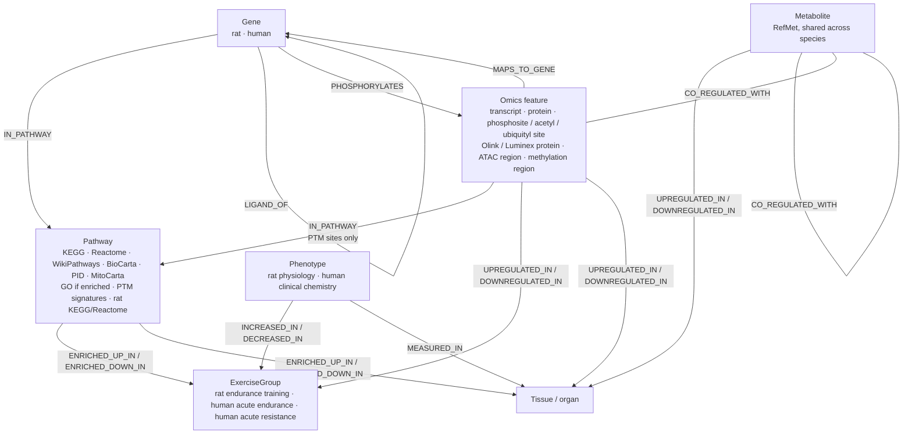

# Exercise KG v0.2: significant-response, pathway-anchored graph

Built by `scripts/build_sig_graph.py` and written to `kg/exports_sig/`. It holds 77.1k nodes and 1.50M edges. Only molecules that change significantly with exercise are included. Sources: rat [D1, D2]; human [D3–D8]; interactions [R1–R6]; pathways [R7–R14]; metabolite names [R15]; tissues [R16]; statistics [M1–M5]; derived scores [P1]; disease & drug layer [R2, R19, R20, M6]. IDs refer to `docs/references.md`, and every edge carries them in `source_refs`. `Reference` nodes in Neo4j hold the full citations.

## What counts as significant

- **Rat:** MoTrPAC's per-sex, per-week calls from the graphical states. A molecule is up or down in a given sex at a given week, or unchanged. The 3% of molecules with no state (mostly ovary and testes) fall back to timewise p < 0.05. The edge property `significance_basis` records which rule applied.
- **Human:** control-adjusted contrasts (exercise-group change minus control-group change), with adjusted p < 0.05.

## Tags on every regulation edge

| Property | Rat | Human |
|---|---|---|
| `species` | rat | human |
| `tissue` | ADRNL … WAT-SC (20) | muscle, adipose, blood |
| `group` | rat:endurance_training | human:endurance_acute / human:resistance_acute |
| `sex` | female / male | both |
| `timepoint` (+ `timepoint_order`, `timescale`) | 1w, 2w, 4w, 8w (weeks of training) | during_20_min … post_24_hr (time relative to the bout) |
| `assay` / `ome` | transcript-rna-seq, prot-pr, prot-ph, prot-ac, prot-ub, immunoassay, metab, epigen-atac-seq, epigen-rrbs | transcript-rna-seq, prot-pr, prot-ph, prot-ol, metabolomics platform |
| statistics | adj p (training q), z, p, per-week adj p | adj p, z, p |
| `weight` | percentile of −log10(adj p) within species × assay × organ | same |
| `significance_basis` | adj_p<0.05 (BH within contrast) | training_q<0.05 + per-week state call |

Nodes carry `species` too. RefMet metabolites are tagged `rat;human` because both species share one node.

## Metabolite rules

The build enforces these and checks them automatically at the end of every run.

- **No metabolite → exercise group edges.**
- **No metabolite → gene edges, and no metabolite → pathway edges.**
- **Metabolites connect to three things only:**
  - **Organs:** `UPREGULATED_IN` or `DOWNREGULATED_IN` edges to a Tissue, one per timepoint. The edge carries species, group, sex, timepoint and assay.
  - **Other metabolites:** `CO_REGULATED_WITH` edges.
  - **Proteins** (global proteome, Olink and Luminex): also `CO_REGULATED_WITH`.
- **How co-regulation is scored.** It uses the Pearson correlation of response profiles within one species and one tissue.
  - **Rat profile:** logFC across 2 sexes × 4 weeks (8 points).
  - **Human profile:** logFC across group × timepoint (6 points in muscle and adipose, 10 in blood).
  - **Cutoff:** an edge needs |r| ≥ 0.9, and each metabolite keeps its 10 strongest partners (`--r-min`, `--top-k`). Edge weight = |r|, and the sign (positive or negative) is stored on the edge.
- **Clinical chemistry is modelled as phenotype, not metabolite.** Human lactate, glucose, cortisol, NEFA, glycerol, ketones, insulin, glucagon and CK are Phenotype nodes.

## Pathways

- **Human curated sets.** These come from the MSigDB collections bundled in the human package (KEGG MEDICUS, Reactome, WikiPathways, BioCarta, PID, MitoCarta), and every set is included. GO terms are included only if they're enriched in at least one human contrast (`--go all` or `--go none` to change this).
- **Rat genes join human pathways through their human ortholog**, with `evidence = via_human_ortholog` and weight 0.8.
- **Phosphosites join kinase and perturbation signatures** (PhosphoSitePlus, PTMsigDB) by their 15-amino-acid flanking sequence. Rat sites get there through the orthologous human site.
- **Rat KEGG and Reactome terms** come from MoTrPAC's cluster enrichment. Gene membership is taken from the enrichment intersections.
- **Pathway → group and tissue edges** come from:
  - human CAMERA-PR and PTM-SEA enrichment (adjusted p < 0.05)
  - rat g:Profiler enrichment of the graphical clusters, with a per-sex direction taken from the cluster state

## Interaction layers

All interaction evidence is human. Rat genes reach it through `ORTHOLOG_OF`, and every edge records whether both ends change in each species.

| Edge | n | Source |
|---|---|---|
| `INTERACTS_WITH` (Gene–Gene, physical) | 165,639 | STRING v12 physical subnetwork, combined score ≥ 700 (64,345 pairs) plus Hetionet v1.0 curated (118,477 pairs); 17,183 pairs are in both. `source` and `string_score` are on each edge |
| `LIGAND_OF` (ligand → receptor) | 3,077 | LIANA consensus resource (OmniPath-derived); complexes split into subunits |
| `PHOSPHORYLATES` (kinase → significant phosphosite) | 745 | PhosphoSitePlus kinase sets bundled with the human MoTrPAC package; rat sites through the orthologous human site |

Kinases get a Gene node even when the kinase itself doesn't change (`is_kinase`), so kinase activity can be inferred from substrate sites. Metabolites stay outside these layers.

**STRING mapping:** STRING protein IDs are mapped to gene symbols with STRING's own `9606.protein.info.v12.0` file.

## Disease and drug layer

Added by `scripts/add_disease_layer.py` from Hetionet v1.0 [R2] (Disease Ontology [R19], DrugBank [R20]). Only genes that respond to exercise (human, or rat via the human ortholog) are linked. Full method in `docs/METHODS.md` §3.13.

| Edge | n | Meaning |
|---|---|---|
| `ASSOCIATED_WITH` (Gene → Disease) | 10,677 | curated gene–disease association |
| `UP_IN_DISEASE` / `DOWN_IN_DISEASE` (Gene → Disease) | 6,585 / 6,477 | gene dysregulated in the disease (disease vs control expression) |
| `BINDS` (Compound → Gene) | 7,429 | drug binds the gene product |
| `TREATS` / `PALLIATES` (Compound → Disease) | 755 / 390 | indication |
| `DISEASE_GENES_ENRICHED_IN` (Disease → Tissue) | 410 | disease genes over-represented among exercise-responsive genes in that organ (hypergeometric, BH adj p < 0.05) [M6, M1, P1] |
| `EXERCISE_OPPOSES` / `EXERCISE_MIMICS` (Disease → Tissue) | 23 / 29 | exercise moves disease-dysregulated genes mostly opposite to / the same as the disease (binomial, BH adj p < 0.05) [M1, P1] |

No disease or drug edge touches a metabolite; the metabolite rules are unchanged.

## Phenotypes

- **Rat:** each trained group is compared with the 8-week sedentary controls within each sex, using Welch's t-test; BH adjustment runs across all rat phenotype tests, and edges are kept at adjusted p < 0.05. The measures are:
  - VO2max change, body-fat change, lean-mass change and blood-lactate change (4 and 8 weeks)
  - body weight and gastrocnemius, plantaris and soleus mass at sacrifice (all weeks)
- **Human:** clinical-chemistry differential results (adjusted p < 0.05), linked to blood.

## Counts

| Nodes | n | Edges | n |
|---|---|---|---|
| TranscriptFeature | 21,901 | UPREGULATED_IN | 176k |
| PTMSite | 9,051 | DOWNREGULATED_IN | 142k |
| ProteinFeature | 2,946 | IN_PATHWAY | 845k (GO BP 478k) |
| Metabolite | 1,833 | ENRICHED_UP_IN / DOWN_IN | 40k / 11k |
| ChromatinRegion | 1,330 | MAPS_TO_GENE | 38k |
| MethylationRegion | 1,052 | CO_REGULATED_WITH | 32k (rat 25k, human 7k) |
| AffinityProtein | 269 | ORTHOLOG_OF | 11.6k |
| Gene | 28,432 | SITE_ON | 2.3k |
| Pathway | 8,731 | ORTHOLOGOUS_SITE | 170 |
| Phenotype | 18 | INCREASED_IN / DECREASED_IN | 65 |
| Tissue / ExerciseGroup | 23 / 3 | MEASURED_IN / EQUIVALENT_TISSUE | 12 / 5 |

## Caveats

- **Human epigenomics** (ATAC and MethylCap differential results) isn't here yet; it still needs the Data Hub download.
- **The metabolite co-regulation edges are only suggestive.** They rest on 6–10 points per profile, so treat them as hypotheses.
- **Rat and human pathway IDs aren't unified.** Rat KEGG/Reactome terms (`KEGG:00190`, `REAC:R-RNO-…`) and human MSigDB sets are separate Pathway nodes. Rat genes still reach the human sets through orthology.
