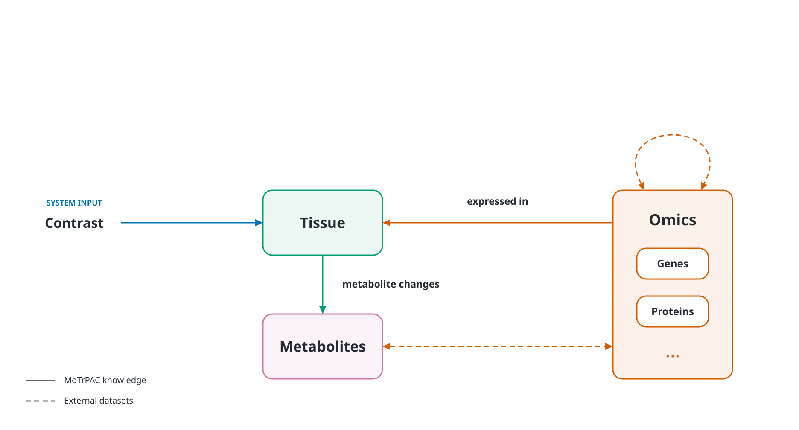

# MoTrPAC multi-omics knowledge graph: overview

A knowledge graph that connects **Tissue, Omics and Metabolites** to describe molecular responses to exercise. MoTrPAC human and rat releases provide the experimental evidence; GTEx and Human-GEM provide human tissue and metabolic context.

---

# Repository structure

```text
multiomics-hackathon-2026-track-4/
├── kg/                     # Knowledge-graph construction and outputs
│   ├── GEM scripts/        # Human-GEM gene–metabolite scripts (Python/R)
│   ├── GTEx script/        # GTEx gene co-expression analysis
│   ├── adjacency/          # Adjacency matrices and identifier mappings
│   ├── explorer/           # Interactive graph viewer
│   │   └── vendor/         # Bundled visualization library
│   ├── exports_sig/        # Significant graph nodes, edges and manifest
│   ├── kg_scripts_omics/   # Multi-omics graph building and export scripts
│   ├── schema/             # Graph schema documentation
│   └── scripts/            # Explorer data-export utility
└── neo4j/                  # Database inputs and supporting documentation
    ├── database/           # Ingestion notebook and dependencies
    └── import/             # Cypher schema and import scripts
```


## 1. Structure of the graph



*The three entity classes and their main relationships. Contrast supplies the experimental context as a system input. Solid lines represent MoTrPAC knowledge; dashed lines represent external dataset relationships. The Omics loop represents relationships within and between molecular layers. Arrow direction alone does not establish causality.*

### The three entity classes

1. **Tissue — where a feature was measured or a gene is expressed.** Includes skeletal muscle, adipose and blood-derived sample types in humans, plus the broader tissue coverage in rats. Whole blood, plasma, serum and PBMC, where available, are represented as distinct sample types under a shared blood parent. Their measurements remain separate.

2. **Omics — genes and non-metabolite molecular features.** Includes genes, transcripts, proteins, phosphosites, other protein modifications, chromatin-accessibility regions and DNA-methylation sites. Genes anchor mappings between layers, while each measured feature retains its own identity.

3. **Metabolites — small molecules and lipids.** Includes measured metabolites such as glucose and lactate, along with reference metabolites used to connect measurements to metabolic reactions. Nodes retain chemical identifiers, annotation confidence and the available level of structural resolution. Metabolomics measurements are assigned to this class, keeping it distinct from Omics.

### How the classes connect

#### MoTrPAC differential analysis

MoTrPAC differential results connect genes and metabolites to the tissues in which they respond to exercise. Derived co-regulation matrices add metabolite–protein associations. Genes and proteins are subtypes of **Omics**, so these connections preserve the three entity classes.

The seven adjacency exports below represent these relationships at different levels of detail. Contrast columns encode experimental context; they do not introduce a fourth entity class.

| Connection | Adjacency export | Dimensions | Edge weight | Retained entries |
|---|---|---|---|---|
| **Tissue–gene: human response by contrast** | `human_gene_contrast_adjacency_12815x21.csv` | 12,815 genes × 21 contrasts | Signed −log10(adjusted p) | 32,735 (12.2%): 19,338 up, 13,397 down |
| **Tissue–gene: rat response by contrast** | `rat_gene_contrast_adjacency_11283x150.csv` | 11,283 genes × 150 contrasts | Signed −log10(training q) | 98,476 (5.8%): 52,836 up, 45,640 down |
| **Tissue–metabolite: human response by contrast** | `human_metab_contrast_adjacency_529x21.csv` | 529 metabolites × 21 contrasts | Signed −log10(adjusted p) | 1,532 (13.8%) |
| **Tissue–metabolite: rat response by contrast** | `rat_metab_contrast_adjacency_1471x140.csv` | 1,471 metabolites × 140 contrasts | Signed −log10(training q) | 12,446 (6.0%) |
| **Tissue–gene: summary across timepoints** | `gene_tissue_adjacency_15894x23.csv` | 15,894 genes aligned to human orthologs × 23 species:tissue combinations | Signed −log10(adjusted p), selecting the strongest response across timepoints | 39,834 (10.9%) |
| **Metabolite–protein: human co-regulation** | `human_metab_protein_coreg_adjacency_431x426.csv` | 431 metabolites × 426 proteins | Pearson correlation coefficient, r | 2,875 (1.6%) |
| **Metabolite–protein: rat co-regulation** | `rat_metab_protein_coreg_adjacency_1153x1980.csv` | 1,153 metabolites × 1,980 proteins | Score definition not supplied | Count and density not supplied |

*Dimensions and counts describe the listed exports, rather than the full MoTrPAC releases. Percentages are retained entries divided by all matrix cells. The two gene–contrast matrices were checked against local CSVs; the remaining figures follow the supplied export summary. The rat co-regulation dimensions are taken from its filename.*

**Tissue–gene and tissue–metabolite connections.** Each nonzero contrast entry becomes a response record on the corresponding molecular-feature–tissue relationship. Human gene-matrix columns encode tissue, exercise-versus-control comparison and timepoint; rat gene-matrix columns encode tissue, sex and training week. Multiple contrast records can therefore describe the same feature–tissue pair. The counts above refer to matrix entries, not necessarily unique graph edges. Proteins and other gene-mapped features retain their assay identities in the underlying evidence; a gene-level export alone does not provide a separate tissue–protein matrix.

**Interpreting response weights.** The sign indicates the direction of the reported effect, while the magnitude measures statistical evidence rather than effect size. Original effect estimates and the exact significance statistic remain attached to each record. Rat training q-values must retain their original test scope and must not be relabeled as timepoint-specific adjusted p-values. A zero denotes no retained connection in the export; its biological interpretation requires the measurement coverage and filtering rules.

**Summarizing across timepoints.** The gene–tissue matrix provides a compact view of the strongest retained response for each species:tissue combination. It preserves the selected observation's direction, but can hide reversals across timepoints or differences between contrasts. The source contrast, assay, timepoint and significance statistic must remain recoverable. Human-ortholog alignment enables comparison while species-specific evidence stays separate.

**Metabolite–protein connections.** Co-regulation records describe associated response patterns. Positive human Pearson r values indicate concordant patterns and negative values indicate opposing patterns. The correlation axis, observation count, tissue context and filtering method must accompany the export. Human aggregate response correlations describe group-level patterns; they do not establish correlations between individuals. Rat sample-level data can support individual-level analyses, but the listed rat matrix's construction must be documented before assigning that interpretation. Co-regulation does not establish that a protein directly acts on a metabolite; Human-GEM supplies that separate reaction-based context.

#### External dataset knowledge

- **GTEx: Omics → Tissue.** Median gene expression provides baseline tissue localization. GTEx is represented within the CFDE ecosystem; the versioned expression matrices used for this graph come from the GTEx Portal. [CFDE processed-data search](https://cfde.cloud/data/processed/help); [GTEx v8 expression downloads](https://www.gtexportal.org/home/downloads/adult-gtex/bulk_tissue_expression.GTExv8).

- **GTEx: Omics ↔ Omics.** Gene-to-gene co-expression is computed from sample-level RNA expression within each tissue. Correlation across tissue medians instead measures similarity of tissue-expression profiles and receives a separate edge type. Gene co-expression can be projected onto mapped protein nodes as a **gene-based proxy**, retaining the source gene pair and mapping confidence.

- **Human-GEM: Omics ↔ Metabolites.** Reaction annotations connect metabolites to genes encoding the enzymes or transporters associated with those reactions. Each association retains its reaction identifiers, gene rule, compartment, substrate or product role and reversibility. This supplies metabolic context for the measured exercise responses. [Human-GEM documentation](https://github.com/SysBioChalmers/Human-GEM).

### How exercise effects are represented

Exercise is the experimental context for an observation. Each differential result is attached to the appropriate **Omics–Tissue** or **Metabolites–Tissue** relationship and retains:

- Source dataset, release version, species and cohort.
- Tissue or blood fraction, assay and original feature identifier.
- Intervention, comparator, contrast definition and sampling time.
- Sex stratum or adjustment information, as reported.
- Effect estimate and scale, uncertainty where available, p-value and reported FDR or adjusted p-value.
- Analysis method and evidence type.

An intervention-versus-control contrast can support an exercise-effect interpretation under the study design and model assumptions. A within-group post-versus-pre change alone does not isolate that effect. Neither contrast establishes a causal relationship between two molecular features; pathway enrichment and co-expression do not acquire causal direction from randomization.

---

## 2. Datasets

| Source | Role in the graph | Access point |
|---|---|---|
| MoTrPAC human acute-exercise release (2026) | Human molecular responses to acute endurance or resistance exercise | [MoTrPAC Data Hub](https://motrpac-data.org/) and public analysis package |
| MoTrPAC rat endurance-training release (2024) | Training responses across tissues, timepoints and sexes | [MoTrPAC rat data package](https://motrpac.github.io/MotrpacRatTraining6moData/) |
| GTEx v8 | Baseline tissue expression, gene co-expression and optional genetic context | [GTEx Portal](https://www.gtexportal.org/home/) and [CFDE discovery](https://cfde.cloud/data/processed/help) |
| Human-GEM | Reference associations between metabolic genes and metabolites | [Human-GEM repository](https://github.com/SysBioChalmers/Human-GEM) |

### 2.1 MoTrPAC human acute-exercise release: primary evidence

The initial human cohort includes 175 sedentary adults randomized to acute endurance exercise, resistance exercise or a non-exercise control condition. The study profiles skeletal muscle, subcutaneous adipose and blood across the acute response. Assay availability and sampling schedules vary by tissue. [Human study report](https://pubmed.ncbi.nlm.nih.gov/42164870/).

**Data used.** Public differential-analysis results, group-level summaries, feature-to-gene mappings and available pathway, kinase and temporal-cluster annotations. The analysis package distinguishes contrast types and provides tissue, assay, feature identifiers, effect estimates and significance statistics. Epigenomic results require a separate download through the package. [Public analysis-package documentation](https://motrpac.github.io/MotrpacHumanPreSuspensionAnalysis/articles/package_overview.html).

**Contribution to the graph.** Human exercise-response evidence attached to Omics–Tissue and Metabolites–Tissue relationships, plus mappings between molecular layers. Clinical analytes are assigned by molecular identity, with assay-specific measurements kept separate. For example, a clinical lactate result and a metabolomics lactate result may refer to the same chemical entity without merging their observations.

**Limits.** This build uses public aggregate results and excludes controlled-access subject-level measurements, detailed phenotypes and genotypes. It focuses on acute responses in the sampled tissues. Covariate adjustment does not provide a sex- or age-stratified effect estimate, and group summaries do not support individual-level correlations.

### 2.2 MoTrPAC rat endurance-training release: complementary evidence

The rat cohort includes 147 six-month-old Fischer 344 rats of both sexes, with endurance training for 1, 2, 4 or 8 weeks and sedentary controls. The release covers 19 tissues and multiple transcriptomic, proteomic, epigenomic, metabolomic and immunoassay platforms. It adds organs that were not sampled in the human study. [MoTrPAC cohort documentation](https://motrpac-data.org/knowledge-center/project-overview/faq); [rat study](https://www.nature.com/articles/s41586-023-06877-w).

**Data used.** Differential results, sex-specific analyses, molecular annotations and public normalized sample-level matrices. Matched measurements can support additional association analyses, with treatment group, sex and training duration accounted for where appropriate. [Rat data-package documentation](https://motrpac.github.io/MotrpacRatTraining6moData/).

**Contribution to the graph.** A training time axis, broader tissue coverage and sex-stratified response evidence. Rat and human genes remain distinct entities connected by versioned orthology mappings, preferentially one-to-one where available. Metabolites are aligned through compatible chemical identifiers and curated RefMet annotations, retaining unresolved or ambiguous matches.

**Limits.** Rat training and human acute exercise differ in species, intervention and timescale. Their evidence remains separately identifiable and is compared for concordance rather than automatically pooled. Human-GEM annotations transferred through orthology are explicitly marked as inferred. The rat cohort represents one strain and age group, limiting generalization.

### 2.3 GTEx v8: tissue localization, co-expression and genetic context

GTEx provides baseline gene-expression and genetic-regulation data from human post-mortem tissues. The v8 regulatory atlas analyzed 49 tissues or cell lines from 838 donors; counts differ across release products and quality-control subsets. [GTEx v8 study](https://pmc.ncbi.nlm.nih.gov/articles/PMC7737656/).

**Data used.** The selected v8 products include gene-expression matrices for individual samples, median expression by tissue and sample annotations. These support two complementary analyses: baseline tissue localization and gene co-expression. [GTEx v8 expression downloads](https://www.gtexportal.org/home/downloads/adult-gtex/bulk_tissue_expression.GTExv8).

**Contribution to the graph.** Median expression supplies Omics–Tissue annotations, including dominant tissue and tissue-specificity scores where calculated. Within-tissue sample-level expression supports gene–gene co-expression edges. The proposed analysis filters poorly expressed genes, applies a documented normalization or transformation, accounts for available technical and biological covariates, and records the correlation method, sample count and multiple-testing procedure. Tissue-median correlations, if included, are labeled as tissue-profile similarity. Projected protein links retain their RNA evidence label and gene-to-protein mapping provenance.

Single-tissue cis-eQTL results for whole blood, skeletal muscle and subcutaneous adipose provide optional genetic context. To preserve the three-class schema, variant identifiers, alleles, association statistics and tissue are stored as supporting records on the relevant gene–tissue relationship. They do not introduce a separate Variant class. If the build restricts these records to Reactome metabolic genes, the gene-set version and resulting count are recorded.

**Limits.** Baseline expression does not locate the exercise response. Co-expression can reflect cell-type composition or shared regulation and does not establish a physical interaction or causal direction. RNA-based protein proxies do not measure protein abundance. GTEx whole blood is not interchangeable with individual blood fractions. An eQTL is a genetic association and does not establish an exercise-dependent regulatory mechanism.

### 2.4 Human-GEM: metabolic connections

Human-GEM is a genome-scale reference model linking human metabolic reactions, metabolites and genes. The build pins a specific model release so that mappings remain reproducible. [Human-GEM repository and release documentation](https://github.com/SysBioChalmers/Human-GEM).

**Data used.** Measured metabolites are matched using compatible chemical identifiers, followed by curated name matching when identity is unambiguous. Compartment and structural specificity are retained where the source supports them.

**Contribution to the graph.** A gene–metabolite association is created when a reaction contains the metabolite and names the gene in its gene–protein–reaction rule. Supporting records retain reaction identifiers, the full gene rule, the metabolite's substrate or product role, reversibility, transport status, compartment and subsystem. Reaction identifiers remain edge evidence rather than a fourth entity class. Retaining the full gene rule preserves the distinction between enzyme complexes and alternative enzymes.

**Limits.** Model membership does not demonstrate reaction activity or flux in an exercised tissue. Highly connected metabolites are flagged by reaction degree so analyses can account for their connectivity. Sum-composition lipids such as `TG 54:6` retain their reported resolution; an exact molecular or gene mapping is made only when supported. Otherwise, they remain class-level or unresolved annotations.
